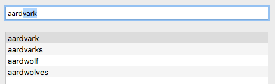

# Omnibar


[](https://github.com/Carthage/Carthage)

A search field with support for auto-completion of typed strings and reactive extensions (RxSwift).

## Overview 

Made to satisfy these needs:

1. Quickly filter search results;
2. Change result selection through use of the arrow keys from within the Omnibar;
3. Offer auto-completion of the search term inside the text field itself.

So if you type "aard", the Omnibar will suggest the term "aardvark" in the example app:

<div align="center">
    
</div>


## Delegate-based Approach

### Displaying Values

Call `display(content: OmnibarContent)` to change the content of the Omnibar and affect the selection. You can also use the `stringValue` property to change the text and put the insertion point at the end like regular `NSTextField`s do. 

```swift
public enum OmnibarContent {

    /// Empties the Omnibar.
    case empty

    /// Display `text` inside the Omnibar and select it all (like ⌘A) for 
    /// quick overwriting.
    case selection(text: String)

    /// Display `text` inside the Omnibar and put the insertion point
    /// at the end.
    case prefix(text: String)

    /// Display `text`, followed by `appendix`, putting the insertion point
    /// before `appendix` and selecting it so it can be overwritten.
    case suggestion(text: String, appendix: String)
}
```

### Reacting to Events

Set `delegate` to be notified of changes. The `OmnibarDelegate` protocol offers these function signatures:

- Optional: `omnibarSelectNext(_ omnibar: Omnibar)` and `omnibarSelectPrevious(_ omnibar: Omnibar)` to change the selected result without unfocusing the Omnibar. 
- Required: `omnibar(_ omnibar: Omnibar, contentChange: OmnibarContentChange, method: ChangeMethod)`, notifying the delegate about the last user interaction and typing change.

`ChangeMethod` can be `.deletion`, `.insertion`, or `.appending` to convey what the user did so you can react to all cases differently.

`OmnibarContentChange` is either a `.replacement` of the old stuff, or a `.continuation` of the last suggestion, if there was any; `.continuation` is just like a self-suggested `OmnibarContent.suggestion` waiting for approval.

```swift
enum OmnibarContentChange {
    case replacement(text: String)
    case continuation(text: String, remainingAppendix: String)
}
```


## Reactive Extension

Implementing delegates is nice and all, but with RxSwift, reacting to search term changes with filtering the results and offering a suggestion from the results back to the Omnibar is even simpler thanks to the declarative nature of observable sequences.

Once you have a reference to `omnibar: Omnibar`, the reactive extension `.rx` offers this:

- `omnibar.rx.text` which behaves just like `NSTextField().rx.text` and sends the whole contents while the user is typing -- it's like a stream of `stringValue` property changes;
- `omnibar.rx.contentChange` emits the changed content, either a `.replacement` or `.continuation`;
- `omnibar.rx.moveSelection` emits either `.previous` (up arrow key) or `.next` (down arrow key);
- `omnibar.rx.content` takes in any `OmnibarContent` value to change the text being displayed.


# Attributions and Contributions

## English Open Word List (EOWL) v1.1.2

The sample app uses a list of 12000+ english words to display and filter.

> The “English Open Word List” (EOWL) was developed by Ken Loge, but is almost entirely derived from the “UK Advanced Cryptics Dictionary” (UKACD) Version 1.6, by J Ross Beresford.

- [English Open Word List](http://dreamsteep.com/projects/the-english-open-word-list.html)
- "UK Advanded Cryptics Dictionary" was formerly available at <http://cfaj.freeshell.org/wordfinder/UKACD17.shtml> but is now down

## License

Copyright (c) 2017 Christian Tietze. Distributed under the MIT License.
