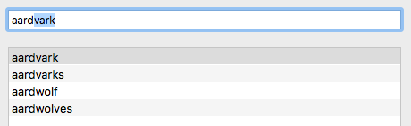

# Omnibar


A search field with support for auto-completion of typed strings.

The package ships two libraries:

- `Omnibar` — the search field and its delegate-based API.
- `AsyncOmnibar` — an `AsyncStream` decoration on top of it, for `for await` instead of delegate callbacks.

> **Looking for RxSwift compatibility?** The reactive extensions (RxSwift) have moved to <https://github.com/CleanCocoa/RxOmnibar> after v0.21. That package targets the pre-2.0.0 delegate API and has not been updated for the renames in 2.0.0.

## Overview

Made to satisfy these needs:

1. Quickly filter search results;
2. Change result selection through use of the arrow keys from within the Omnibar;
3. Offer auto-completion of the search term inside the text field itself.

So if you type "aard", the Omnibar will suggest the term "aardvark" in the example app:

<div align="center">
    
</div>


## Delegate-based Approach

### Displaying Values

Call `display(content: OmnibarContent)` to change the content of the Omnibar and affect the selection. You can also use the `stringValue` property to change the text and put the insertion point at the end like regular `NSTextField`s do.

```swift
public enum OmnibarContent {

    /// Empties the Omnibar.
    case empty

    /// Display `text` inside the Omnibar and select it all (like ⌘A) for
    /// quick overwriting.
    case selection(text: String)

    /// Display `text` inside the Omnibar and put the insertion point
    /// at the end.
    case prefix(text: String)

    /// Display `text`, followed by `appendix`, putting the insertion point
    /// before `appendix` and selecting it so it can be overwritten.
    case suggestion(text: String, appendix: String)
}
```

### Reacting to Events

Set `omnibarContentChangeDelegate` to be notified of text changes. The `OmnibarContentChangeDelegate` protocol is `@MainActor` and requires all three of:

```swift
func omnibar(_ omnibar: Omnibar, didChangeContent contentChange: OmnibarContentChange, method: ChangeMethod)
func omnibar(_ omnibar: Omnibar, commit text: String)
func omnibarDidCancelOperation(_ omnibar: Omnibar)
```

Arrow keys are a separate concern: set `moveFromOmnibar` to change the selected result without unfocusing the Omnibar.

```swift
omnibar.moveFromOmnibar = MoveFromOmnibar { event in
    // event.movement is .up, .down, .top, or .bottom
    // event.isExpandingSelection is true when Shift was held
}
```

`ChangeMethod` can be `.programmaticReplacement`, `.deletion`, `.insertion`, or `.appending` to convey what the user did so you can react to all cases differently.

`OmnibarContentChange` is either a `.replacement` of the old stuff, or a `.continuation` of the last suggestion, if there was any; `.continuation` is just like a self-suggested `OmnibarContent.suggestion` waiting for approval.

```swift
enum OmnibarContentChange {
    case replacement(text: String)
    case continuation(text: String, remainingAppendix: String)
}
```

## Async Streams

`AsyncOmnibar` republishes the same interactions as an `AsyncStream`. The observer takes over the Omnibar's delegate and action slots for as long as it lives, so store it, and call `finish()` when its owner goes away:

```swift
import AsyncOmnibar

self.events = OmnibarEvents(omnibar: omnibar)
self.observation = Task { [events] in
    for await event in events.makeStream() {
        switch event {
        case let .contentChange(change, method):
            guard method != .programmaticReplacement else { continue }
            await search(for: change.text, offerSuggestion: method == .appending)
        case let .commit(text):
            open(text)
        case let .movement(movement):
            moveSelection(movement)
        case .cancel:
            break
        }
    }
}

deinit {
    events.finish()
}
```

`finish()` is not optional bookkeeping. A task consuming a stream holds the observer alive, and the observer only ends its streams once it is released — so relying on deallocation to stop the loop waits for a deallocation the loop itself prevents. Calling `finish()` ends every stream, and hands the delegate and action slots back to whatever held them before, so an Omnibar that already had a delegate keeps working afterwards.

All event kinds share one stream because their order matters: clearing the Omnibar with Esc emits the `.contentChange` for the emptied text before the `.cancel`.

`makeStream()` can be called more than once, and every stream sees every event. Streams handed out after `finish()` are already finished. Displaying content stays synchronous — call `omnibar.display(content:)` from the main actor. To discard results of a search the user has already typed past, cancel the previous task:

```swift
searchTask?.cancel()
searchTask = Task { ... }
```

# Attributions and Contributions

## English Open Word List (EOWL) v1.1.2

The sample app uses a list of 12000+ english words to display and filter.

> The “English Open Word List” (EOWL) was developed by Ken Loge, but is almost entirely derived from the “UK Advanced Cryptics Dictionary” (UKACD) Version 1.6, by J Ross Beresford.

- [English Open Word List](http://dreamsteep.com/projects/the-english-open-word-list.html)
- "UK Advanded Cryptics Dictionary" was formerly available at <http://cfaj.freeshell.org/wordfinder/UKACD17.shtml> but is now down

## License

### Omnibar

Copyright (c) 2017 Christian Tietze. Distributed under the MIT License.

### English Open Word List (EOWL)

Copyright © J Ross Beresford 1993-1999. All Rights Reserved. The following restriction is placed on the use of this publication: if the UK Advanced Cryptics Dictionary is used in a software package or redistributed in any form, the copyright notice must be prominently displayed and the text of this document must be included verbatim.

